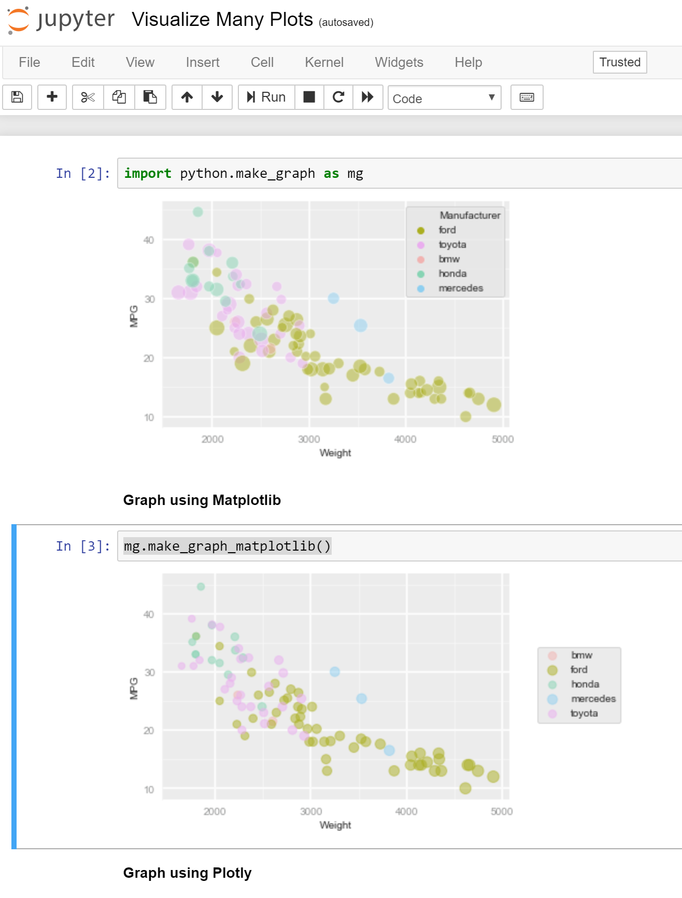
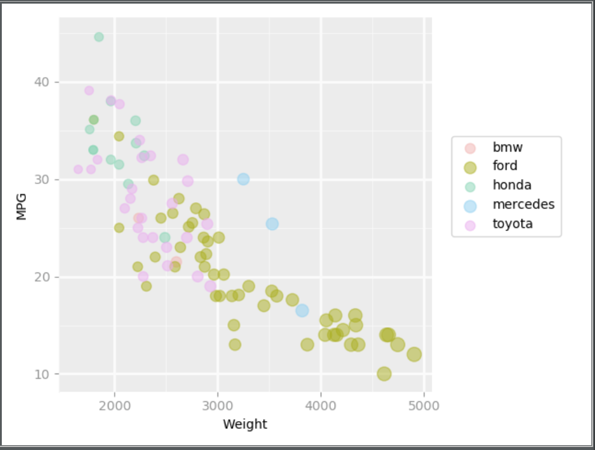

# 02-DataVis-7ways

Assignment 2 - Data Visualization, 7 Ways  
===
 ## Overall Design Achievements
- Added legends for all plots that show the type of manufacturer with the corresponding color and/or weight
- Added background major and minor grids (except for D3 where I only did major, and Excel where the software only allowed me to do major)

## Overall Technical Achievements
- Being able to visualize the Python part of my assignment through Jupyter Notebook
 

** There are also individual design/technical achievements for every visualization
 
 ## Vis 1: Python with Matplotlib
 - In this visualization I was able to achieve all the criteria needed by the assignment, as well as add the grids and a legend
 
 
 
 ## Vis 2: Python with Plotly
 
 ### Design/Technical Achievements
 - Hovering over the data points will show the exact values of Weight and MPG for that point, as well as manufacturer
 

 ## Vis 3: Matlab
 
 - With Matlab I used the gscatter function to create the graph. Matlab has still not made it possible to change the 
 transparency of markers created using this function. 
 - I was unable to make the minor grid lines be continuous instead of dotted, or change their color. 
 - I could change the color of the major gridlines to an off-white like the other graphs, but in Matlab that was 
 indistinguishable from the plot's background, so I decided to keep the default line color as it looked better.
 
 ### Design/Technical Achievements
 - Hovering over a point will show its exact X and Y values 
 

 
 ## Vis 4:  D3
 - I was unable to reproduce the background color exactly with D3 but everything else was just fine
 
 ## Design achievement
 - Dots transition from black to their respective color
 - Axes move to their positions
 - Grid appears afterwards
 - Customized font for tick and axis labels
 
 ## Technical Achievement
 - Hovering over the datapoints will show information about the manufacturer, weight, and MPG
  

 ## Vis 5: R
 - Nothing particularly special about this one
  

 
 ## Vis 6: Seaborn
  

 
 ## Vis 7: Excel
 - Excel offers very little tools to manipulate my graph, so because of this I was unable to tweak the size of the scatterplot markers based on weight.
- Other limitations included not being able to choose the location of the ticks and not being able to manually create major and minor grids.

 

 